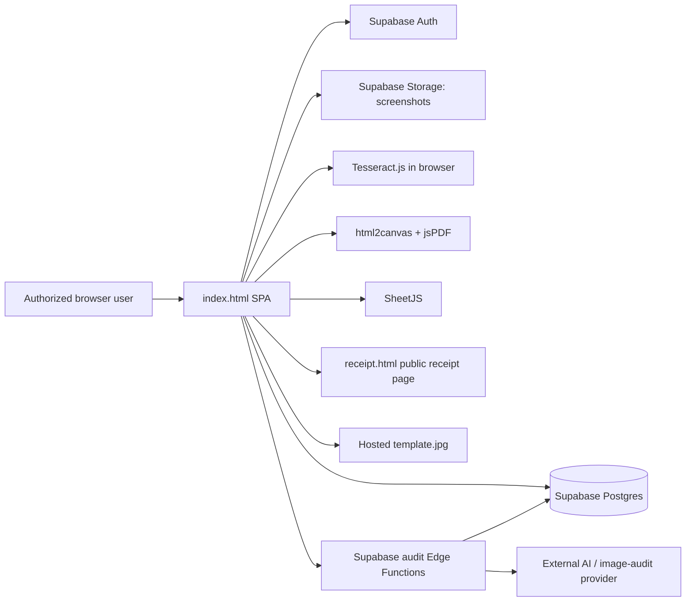

# Vardhman Sanskar Dham — Online Donation Receipt System

A browser-based donation receipt management application for **Vardhman Sanskar Dham (VSD)**. The system supports authenticated receipt generation, donor management, role-based access, payment-proof handling, WhatsApp delivery, finance reconciliation, operational reporting, and audit workflows.

> **Documentation baseline:** 2 October 2026  
> **Current frontend source of truth:** `index.html`  
> **Application style:** Single-page, single-file HTML/CSS/JavaScript application backed by Supabase

---

## Table of contents

- [Overview](#overview)
- [Current project status](#current-project-status)
- [Main features](#main-features)
- [Architecture](#architecture)
- [Technology stack](#technology-stack)
- [Donation funds](#donation-funds)
- [Roles and permissions](#roles-and-permissions)
- [Receipt-generation workflow](#receipt-generation-workflow)
- [Receipt outputs and sharing](#receipt-outputs-and-sharing)
- [Records and donor management](#records-and-donor-management)
- [Finance and bank reconciliation](#finance-and-bank-reconciliation)
- [Administration and operations](#administration-and-operations)
- [Prabhu Pooja URL-prefill integration](#prabhu-pooja-url-prefill-integration)
- [Repository and deployment files](#repository-and-deployment-files)
- [Prerequisites](#prerequisites)
- [Supabase requirements](#supabase-requirements)
- [Frontend configuration](#frontend-configuration)
- [Local development](#local-development)
- [GitHub Pages deployment](#github-pages-deployment)
- [Security and privacy](#security-and-privacy)
- [Operational notes](#operational-notes)
- [Known limitations and maintenance items](#known-limitations-and-maintenance-items)
- [Troubleshooting](#troubleshooting)
- [Documentation update policy](#documentation-update-policy)
- [Changelog](#changelog)
- [License](#license)

---

## Overview

The application is designed to manage the complete operational lifecycle of an online donation receipt:

1. Authenticate an authorized user.
2. Capture donor and donation details.
3. Allocate the donation across one or more VSD funds.
4. Capture and OCR a payment screenshot.
5. Atomically assign an official receipt number for the current financial year.
6. Store the receipt and payment proof in Supabase.
7. Update the donor master.
8. Generate a printable and downloadable receipt.
9. Share the receipt through WhatsApp or a public tokenized link.
10. Make the transaction available for reporting, reconciliation, and audit.

The frontend is intentionally implemented as a static browser application. It does not require a Node.js build process, but it depends on Supabase and several CDN-hosted JavaScript libraries at runtime.

---

## Current project status

| Area | Status |
|---|---|
| Authenticated receipt creation | Implemented |
| Financial-year receipt numbering | Implemented |
| Donor master and quick search | Implemented |
| Receipt PDF, print, image, and sharing | Implemented |
| Records, filters, pagination, editing, and statuses | Implemented |
| Summary and volunteer reporting | Implemented |
| User and role administration | Implemented |
| Financial-year stop controls | Implemented |
| Bank reconciliation | Implemented |
| AI-assisted screenshot audit interface | Implemented; requires external Supabase Edge Functions |
| Donor outreach and bulk WhatsApp tools | Implemented |
| Donor poster generator | Included; requires a hosted template and navigation/configuration review |
| Tally suspense receipt creation | **Planned — not yet implemented** |

The **Suspense Receipt Creation** section currently contains only a placeholder for a future workflow that will upload a Tally suspense export and generate receipts after review and validation.

---

## Main features

### Receipt creation

- Supabase email/password authentication.
- Auto-filled logged-in generator name and location.
- Optional reference volunteer for the person who brought the donor.
- Existing-donor quick search by name, mobile number, or PAN.
- Multiple donation-fund allocations in one receipt.
- Automatic total calculation.
- UPI/QR, cheque, and bank-transfer workflows.
- Browser-based OCR of payment screenshots using Tesseract.js.
- Screenshot compression before upload.
- Required transaction/reference number for non-cash payments.
- Bank-name validation for cheque payments.
- PAN-format validation and PAN requirement above ₹20,000.
- Mobile and email validation.
- Internal notes that are not printed or sent to the donor.
- Financial-year closure control.
- Official-origin restriction before receipt generation.
- Duplicate-submit protection after successful generation.

### Receipt numbering

- Official receipt numbers use the format `OR00001`.
- The sequence is separated by the April–March Indian financial year.
- The current financial year is represented as `YYYY-YY`, for example `2026-27`.
- Supabase RPC `increment_receipt_counter` is used for atomic numbering.
- The next expected number is refreshed periodically in the interface.

### Receipt delivery

- Print-ready receipt preview.
- A5 PDF generation.
- Embedded additional 80G certificate page in the generated PDF.
- PNG receipt generation.
- Native mobile share where the browser supports file sharing.
- WhatsApp text delivery.
- WhatsApp image-sharing/download fallback.
- Tokenized public receipt-download link.
- Fixed VSD UPI QR code on the receipt.
- `CANCELLED` and `DUPLICATE` watermarks for non-valid receipts.

### Records and reporting

- Search by donor name, receipt number, PAN, or volunteer.
- Payment-method filtering.
- Paginated records table.
- Receipt view and limited-detail editing.
- Direct access to stored payment screenshots.
- Valid, invalid, and duplicate receipt statuses.
- CSV export.
- Collection totals and fund-wise reporting.
- Today and current-month activity summaries.
- Volunteer collection summaries.
- WhatsApp delivery-status tracking.

### Finance and audit

- Bank-statement import from XLSX, XLS, or CSV.
- UTR/reference matching against receipts.
- Recognition of selected raw bank-export formats.
- Matched, bank-only, receipt-only, and amount-mismatch classifications.
- Reconciliation workbook export.
- Audit-run history and detailed audit-result views.
- Manual audit and historical backfill controls.
- Audit-result Excel export.
- Optional audit credit-balance check.

---

## Architecture



### Component responsibilities

| Component | Responsibility |
|---|---|
| `index.html` | Main SPA, UI, validation, receipt rendering, Supabase calls, exports, and operational tools |
| Supabase Auth | Email/password authentication |
| Supabase Postgres | Receipts, donors, profiles, counters, settings, and audit data |
| Supabase Storage | Payment screenshot storage |
| `receipt.html` | Public receipt lookup/download page using receipt ID and share token |
| `template.jpg` | Background template for the poster generator |
| Audit Edge Functions | Screenshot analysis, historical backfill, and credit-balance lookup |
| GitHub Pages/static host | HTTPS delivery of the frontend and public assets |

> The reviewed frontend references companion backend and static files that are not contained in the reviewed `index.html` attachment. They must be deployed and maintained separately.

---

## Technology stack

| Technology | Use |
|---|---|
| Vanilla HTML, CSS, and JavaScript | Application UI and business logic |
| Supabase JavaScript v2 | Auth, Postgres, RPC, and Storage |
| Tesseract.js v5 | Browser-based payment-screenshot OCR |
| QRious 4.0.2 | UPI QR rendering |
| html2canvas 1.4.1 | Receipt-to-canvas capture |
| jsPDF 2.5.1 | PDF generation |
| SheetJS 0.20.3 | Excel/CSV parsing and export |
| Google Fonts | Gujarati, serif, and monospace typography |
| GitHub Pages or another static host | Frontend hosting |

There is currently no bundler, package manager, or compile step. The browser loads third-party libraries from CDNs.

---

## Donation funds

The current source defines these funds:

1. `ANIMAL WELFARE FUND (JIVDAYA)`
2. `SOCIAL WELFARE FUND (ANUKAMPA)`
3. `EDUCATION FUND`
4. `SADHARMIK BHAKTI FUND`
5. `VAIYAVACH FUND`
6. `GENERAL FUND`
7. `OTHER FUND`

A single receipt can allocate amounts to multiple funds. The receipt total is the sum of all positive fund allocations.

---

## Roles and permissions

The frontend recognizes five roles:

- `superadmin`
- `admin`
- `finance`
- `location_admin`
- `volunteer`

### Frontend access matrix

| Capability | Super Admin | Admin | Finance | Location Admin | Volunteer |
|---|:---:|:---:|:---:|:---:|:---:|
| Create a new receipt | ✓ | ✓ | ✓ | ✓ | ✓ |
| Open Records | All | All | All | Own location | Referenced/generated by self |
| Open Summary | ✓ | ✓ | ✓ | Own location | — |
| Open Admin | ✓ | ✓ | — | — | — |
| Open Finance | ✓ | — | ✓ | — | — |
| Change receipt status | ✓ | ✓ | — | — | — |
| Export receipt CSV | ✓ | ✓ | ✓ | — | — |
| Configure FY stop date | ✓ | — | — | — | — |
| Create every role | ✓ | — | — | — | — |
| Create volunteer/location-admin users | ✓ | ✓ | — | — | — |

### Record visibility

- **Volunteer:** receipts where the volunteer is either the reference volunteer or the logged-in generator.
- **Location Admin:** receipts matching the profile location.
- **Super Admin, Admin, and Finance:** all receipts in the frontend query.

### Important security note

Frontend tab visibility is not a security boundary. Supabase Row Level Security policies must independently enforce every read and write permission.

---

## Receipt-generation workflow

### 1. Login and profile loading

After authentication, the app loads the user profile from `user_profiles` and stores:

- Role
- Full name
- Location

The profile full name becomes the locked **generated by** value on the receipt form.

### 2. Donor details

The form captures:

- Donor name
- Address
- Mobile number
- PAN
- Email

The quick-search control queries the donor master after at least three characters and can refill donor details.

### 3. Donation allocation

The user enters an amount against one or more VSD funds. The total is calculated automatically.

### 4. Volunteer attribution

Two concepts must remain separate:

- **Reference volunteer (`volunteer`)** — the person who brought or referred the donor. If no separate reference volunteer is entered, the logged-in generator is used.
- **Generated by (`generated_by`)** — the authenticated user who created the receipt.

Both values and their location context are used in reports and access rules. Future modifications must not merge these two concepts.

### 5. Payment proof and OCR

For UPI/QR and bank-transfer payments:

- A screenshot is required.
- Tesseract.js runs in the browser.
- The app attempts to identify a UTR, transaction ID, or reference number.
- The user must verify the detected value before generating the receipt.

For cheque payments:

- Cheque number is entered manually.
- Bank name is mandatory.
- A payment screenshot is still required by the current non-cash validation path.

The active UI currently exposes:

- UPI/QR
- Cheque
- Bank Transfer

Legacy Cash handling remains in the source, but the Cash payment button is currently disabled/commented in the receipt form.

### 6. Validation

The app currently checks:

- Official deployment origin.
- Financial-year receipt-generation status.
- Donor name.
- Optional mobile format: 10 digits starting with 6–9.
- Optional PAN format: `ABCDE1234F`.
- Optional email syntax.
- At least one positive fund amount.
- PAN is mandatory when the total is above ₹20,000.
- Donation date.
- Reference volunteer/generated-by value.
- Transaction/reference number for non-cash payments.
- Payment screenshot for non-cash payments.
- Bank name for cheques.
- Active Supabase connection before receipt generation.

### 7. Numbering, upload, and persistence

The app then:

1. Calls `increment_receipt_counter` for the current financial year.
2. Builds an `OR` receipt number.
3. Compresses the screenshot to JPEG, with a maximum width of approximately 800 px and quality of approximately 0.7.
4. Uploads the file to the `screenshots` storage bucket.
5. Inserts the receipt into `receipts`.
6. Inserts or updates the donor in `donors`.
7. Generates a share token.
8. Renders the receipt preview.
9. Disables the Generate button until the user starts a new receipt.

---

## Receipt outputs and sharing

### Print

The print stylesheet isolates the receipt area and preserves branded receipt colors.

### PDF

The PDF flow captures the HTML receipt and creates an A5-width document. The current source also appends an embedded 80G certificate image as an additional page.

### Image

The receipt can be captured as PNG for download or native sharing.

### WhatsApp

The app supports:

- Text message to the donor.
- Image sharing through the browser's native share API.
- Download fallback when native file sharing is unavailable.
- Marking `wa_sent` after a WhatsApp action.

### Public link

The current link pattern is:

```text
https://vsddombivli.github.io/Digital_Receipt_System/receipt.html?id=<RECEIPT_ID>&token=<SHARE_TOKEN>
```

The public `receipt.html` implementation is a required companion file and was not part of the reviewed frontend attachment.

---

## Records and donor management

### Records table

The Records tab supports:

- Search
- Payment filter
- Pagination, currently 50 records per page
- Receipt selection
- View
- Edit
- PDF download
- Screenshot view
- WhatsApp text/image actions
- Valid/invalid/duplicate status changes for authorized roles

### Receipt editing

The current edit modal focuses on non-financial fields such as:

- Donor name
- Address
- Mobile
- PAN
- Reference volunteer
- Internal notes

Financial allocations and the official receipt amount are not part of the normal edit form.

### Donor master

After receipt generation, the donor master is updated using mobile, PAN, and then donor name as matching options. It tracks data such as:

- Number of donations
- Total donated
- First-seen date
- Last-donated date
- Contact details
- Added-by user and location
- Reference volunteer and location context

### CSV export

The receipt CSV includes operational fields such as:

- Receipt number and date
- Donor details
- Account allocations
- Total and payment data
- Reference number
- Bank and branch
- Reference volunteer and location
- Generated-by user and location
- Status
- WhatsApp status
- Screenshot URL
- Public receipt link

---

## Finance and bank reconciliation

### Accepted file types

- `.xlsx`
- `.xls`
- `.csv`

### Standard input columns

The standard format requires these exact column names:

```text
Date, Description, Amount, Reference
```

`Reference` should contain the UTR, transaction number, or cheque number.

### Raw bank-format normalization

The code can also recognize selected bank exports that contain columns similar to:

- Transaction Date or Value Date
- Transaction Remarks
- Deposit Amount
- Withdrawal Amount
- Transaction/Tran ID

Only positive deposit rows are used. The normalization logic attempts to extract references from selected UPI, IMPS, NEFT, internal-transfer, and CAM-style descriptions.

### Matching behavior

- Matching is case-insensitive after trimming the reference.
- Multiple receipts sharing the same reference are combined for amount comparison.
- An amount difference of up to ₹1 is treated as a match.
- Invalid receipts are excluded from reconciliation.
- Optional receipt-date filtering is available.

### Result groups

1. Matched transactions
2. In bank but no receipt
3. Receipt but no bank entry
4. Amount mismatch

### Reconciliation export

The Excel export creates separate worksheets for:

- Matched
- Bank Only
- Receipt Only
- Mismatch

---

## Administration and operations

### User management

Authorized administrators can:

- Create Supabase Auth users through the frontend sign-up flow.
- Create/update the linked `user_profiles` row.
- Maintain name, phone, location, and role.
- Remove a user-profile row.

> Removing a row from `user_profiles` does not necessarily remove the corresponding Supabase Auth identity. Complete Auth-user deletion should be performed through a secure server-side administrative function or Supabase dashboard.

### Financial-year stop control

The Super Admin can store:

- `fy_stop_date`
- `fy_stop_contact`

After the configured date, receipt generation is blocked and a contact message is displayed.

### Start-new-financial-year operation

The current reset utility:

1. Deletes the counter row for a selected financial year.
2. Sets `screenshot_url` to `NULL` on receipts for that year.
3. Preserves the receipt rows.
4. Requires manual deletion of the physical screenshot objects from Supabase Storage.

Use this tool only after backups and financial close procedures are complete.

### Bulk WhatsApp

The application includes:

- End-of-day delivery for receipts with a donor mobile number and pending WhatsApp status.
- Sequential WhatsApp opening to reduce browser blocking.
- Per-receipt delivery controls.

### Volunteer collection summary

The admin workflow groups valid receipts by generator/reference context and shows:

- Receipt count
- Total collection
- Location
- Latest donation date
- WhatsApp thank-you action

### Donor outreach

For a selected financial year, the app can:

- Load valid receipts.
- Apply an optional minimum-amount filter.
- Group donor lists by volunteer.
- Merge repeat donations for the same donor.
- Build a WhatsApp outreach message for each volunteer.

### Audit interface

The Audit section expects:

- `audit_runs`
- `audit_results`
- Edge Function `audit-scan-images`
- Edge Function `audit-credit-check`

It supports today's audit, paginated historical backfill, discrepancy views, UTR checks, screenshot links, cost reporting, and Excel export.

### Poster generator

A donor poster canvas workflow is included. It requires:

- Donor name
- Donor photo
- A cross-origin-loadable template image

The current template URL points to:

```text
https://vsddombivli.github.io/Digital_Receipt_System/template.jpg
```

The reviewed file contains the poster panel, but it does not currently expose a normal top-level Poster tab button. Navigation and permissions should be reviewed before treating it as a production feature.

---

## Prabhu Pooja URL-prefill integration

The app can detect URL query parameters from a Prabhu Pooja workflow and apply them after login.

Recognized parameters include:

```text
donor_name
donor_mobile
donor_pan
amount
date
payment_mode
txn_ref
from_location
fiscal_year
sundays
gift_source
```

The integration prefills donor/payment fields and builds internal notes containing Prabhu Pooja context.

When extending this integration, ensure that the incoming amount is also allocated to a valid donation fund rather than only changing the displayed total.

---

## Repository and deployment files

A maintainable repository should use a structure similar to:

```text
/
├── index.html                 # Main SPA
├── receipt.html               # Public receipt view/download page
├── template.jpg               # Poster template
├── README.md                  # This documentation
├── LICENSE                    # Add when a license is selected
└── supabase/
    ├── migrations/            # Recommended: versioned SQL migrations
    └── functions/
        ├── audit-scan-images/
        └── audit-credit-check/
```

Only `index.html` was available in the source reviewed for this documentation. The exact production SQL migrations, Edge Function source, `receipt.html`, and poster template were not included.

---

## Prerequisites

- A Supabase project.
- Supabase email/password authentication enabled.
- Postgres tables, RPC, RLS policies, and indexes matching the frontend contract.
- A `screenshots` storage bucket.
- Audit Edge Functions when audit functionality is required.
- HTTPS static hosting.
- A modern browser with JavaScript, Canvas, FileReader, and optional Web Share support.
- Network access to the configured CDN libraries.

---

## Supabase requirements

### Important schema note

The setup SQL embedded in the application's connection modal describes an earlier, smaller schema. It does **not** contain every table, column, role, policy, storage rule, and Edge Function expected by the current frontend.

Do not treat the embedded modal SQL as the authoritative production migration. Maintain complete version-controlled migrations in the repository.

### Frontend data contract

The following list documents the objects referenced by the frontend. It is a contract/checklist, not a ready-to-run migration.

#### `receipts`

Expected fields include:

```text
receipt_id
donation_date
donor_name
donor_address
donor_mobile
donor_email
donor_pan
accounts
total_amount
payment_method
payment_ref
bank_name
branch_name
screenshot_url
volunteer
volunteer_location
generated_by
generated_by_location
share_token
remarks
notes
wa_sent
status
financial_year
created_at
```

Recommended constraints/indexes include:

- Unique `receipt_id`.
- Index on `financial_year`.
- Index on `donation_date`.
- Index on `payment_ref`.
- Indexes supporting donor-name, PAN, volunteer, generator, and location searches.
- A controlled status set such as `valid`, `invalid`, and `duplicate`.

#### `receipt_counter`

```text
financial_year
current_value
```

`financial_year` should be unique or the primary key.

#### RPC: `increment_receipt_counter`

The function accepts a financial-year value and must atomically insert or increment the matching counter row, returning the new integer value.

#### `user_profiles`

Expected fields include:

```text
id
email
full_name
role
location
phone
created_at
```

The `id` should reference `auth.users.id`.

The role constraint must permit all currently supported roles:

```text
superadmin
admin
finance
location_admin
volunteer
```

#### `donors`

Expected fields include:

```text
id
name
mobile
pan
address
email
times_donated
total_donated
first_seen
last_donated
added_by
added_location
ref_volunteer
ref_location
updated_at
```

Uniqueness and duplicate-resolution rules should be explicitly designed for mobile, PAN, and normalized donor name.

#### `app_settings`

Expected fields include:

```text
key
value
updated_by
updated_at
```

Current keys:

```text
fy_stop_date
fy_stop_contact
```

#### `audit_runs`

Stores audit execution metadata, processing counts, discrepancy counts, cost information, creator, status, and timestamps.

#### `audit_results`

Stores receipt-level audit results, extracted amount/UTR, payee checks, raw extraction data, discrepancy notes, screenshot URL, and UTR-check status.

### Storage

The frontend uploads compressed JPEG files to:

```text
screenshots
```

The current code uses `getPublicUrl`, so the implementation expects publicly accessible object URLs. Review the privacy implications carefully; a private bucket with signed URLs is safer for payment screenshots.

### Edge Functions

The frontend calls:

```text
/functions/v1/audit-scan-images
/functions/v1/audit-credit-check
```

Both calls send the logged-in user's Supabase access token. The functions must verify authentication and authorization server-side.

### RLS expectations

At minimum, policies should enforce:

- Volunteers can only read receipts that they generated or are referenced on.
- Location admins can only read permitted location data.
- Finance access is limited to the finance scope.
- Admin and Super Admin write operations are separately controlled.
- Only approved roles can change receipt statuses.
- Only Super Admin can modify financial-year controls.
- Donor and screenshot access is restricted appropriately.
- Public receipt access validates both receipt ID and share token without exposing unrestricted receipt queries.

Avoid broad production policies such as unrestricted `USING (true)` unless the security implications have been reviewed and explicitly accepted.

---

## Frontend configuration

Review the following source-level configuration before deployment.

### 1. Supabase URL and anon key

The frontend contains:

```js
const HARDCODED_URL = '...';
const HARDCODED_KEY = '...';
```

Use only the Supabase **anon/public key** in browser code. Never place a service-role key or other privileged secret in the repository.

For a shared deployment, configure the correct project URL and anon key in the constants. Alternatively, restore the placeholder values and use the in-app connection modal, which stores values in browser `localStorage`.

Because hardcoded values take priority, localStorage overrides are used only when the constants contain their placeholder values.

### 2. Allowed deployment origin

Receipt generation is restricted by `isAllowedOrigin()`.

The current allowed origin is:

```text
https://vsddombivli.github.io
```

Add the exact production or local-development origin when hosting elsewhere. Keep this check aligned with the actual deployment URL.

### 3. Public receipt URL

The WhatsApp/CSV public link is currently hardcoded to the GitHub Pages path. Update every public-link builder if the repository or domain changes.

### 4. Poster-template URL

Update `POSTER_TEMPLATE_URL` when the template location changes. The server must permit cross-origin image use by Canvas.

### 5. UPI QR configuration

The receipt contains a fixed UPI URI. Verify the payee address, payee name, merchant/reference values, and other UPI parameters before production deployment.

### 6. Organization and statutory details

Review all embedded organization names, legal registration details, PAN text, 80G details, addresses, certificate images, and receipt wording before publishing changes.

### 7. Donation funds

Update the `ACCOUNTS` array when an approved fund is added, renamed, or retired. Also review historical reporting compatibility before renaming an existing value.

### 8. CDN dependencies

The app relies on third-party CDNs. For stronger availability and supply-chain control, pin integrity hashes or self-host approved library builds.

---

## Local development

Because the application performs origin checks and uses browser APIs, serve it over HTTP rather than opening `index.html` directly.

Example using Python:

```bash
python -m http.server 8080
```

Then open:

```text
http://localhost:8080
```

For local receipt-generation testing, temporarily add the exact local origin to `isAllowedOrigin()`:

```js
const allowed = [
  'https://vsddombivli.github.io',
  'http://localhost:8080'
];
```

Remove unneeded development origins before production deployment.

### Local smoke-test checklist

- Login succeeds.
- Profile role, name, and location load correctly.
- Next receipt number displays.
- Existing-donor search works.
- Fund allocations calculate correctly.
- OCR failure still allows manual reference entry.
- Screenshot upload returns a usable URL.
- Receipt number increments only once.
- Receipt row and donor row are stored.
- PDF and print output render correctly.
- WhatsApp/public links use the correct domain.
- Role and location restrictions behave as expected.

---

## GitHub Pages deployment

1. Commit the required static files to the repository.
2. Open **Repository Settings → Pages**.
3. Select the deployment branch and folder.
4. Wait for the HTTPS Pages URL.
5. Confirm the repository path in public receipt and template URLs.
6. Confirm the Pages origin in `isAllowedOrigin()`.
7. Configure Supabase Auth site/redirect URLs when required.
8. Confirm Supabase RLS and Storage policies before sharing the URL.
9. Test with one account from every role.
10. Generate a low-value test receipt and verify its complete lifecycle.

The app is path-sensitive because some URLs currently include `/Digital_Receipt_System/` explicitly.

---

## Security and privacy

This application processes donor PII and payment evidence. Treat security and retention as production requirements.

### Required controls

- Never commit a Supabase service-role key.
- Enforce permissions with RLS, not only JavaScript UI checks.
- Verify role claims/profile data server-side for privileged operations.
- Restrict Edge Functions to authorized users.
- Back up Postgres before migrations and financial-year operations.
- Define retention rules for payment screenshots.
- Review whether screenshots should be public.
- Avoid exposing donor exports to unauthorized roles.
- Review all public-receipt queries for share-token validation.
- Rotate compromised credentials immediately.
- Record and review administrative changes.

### Current security considerations

- The frontend uses a public Storage URL for screenshots.
- Share tokens are generated in browser JavaScript using `Math.random()` and the current time; this is not a cryptographically strong token generator.
- User creation occurs through a client-side sign-up flow.
- User-profile deletion does not automatically delete the Auth identity.
- Any permissive RLS policy in an older setup script must be replaced with production-grade policies.

---

## Operational notes

### Local-storage fallback

The source contains localStorage helpers, but normal production receipt generation explicitly requires a working Supabase connection and performs a live database check. Local storage should not be treated as the official accounting record.

A failed database insert may currently be copied to local storage. Such a situation requires immediate reconciliation because the official number may already have been allocated.

### Receipt statuses

- `valid` — included in normal operational reporting.
- `invalid` — displayed as cancelled and excluded from selected reports/reconciliation.
- `duplicate` — displayed as duplicate and excluded from selected reports.

### Financial-year reset

Export and back up records before resetting a counter or clearing screenshot URLs. Deleting screenshot URLs from rows does not delete the Storage objects.

### Payment screenshot OCR

OCR is an aid, not an authoritative verification source. The operator must compare the detected UTR/reference with the screenshot before submission.

### Reference volunteer versus generator

Maintain these as separate database fields and reporting dimensions. A reference volunteer receives donor-attribution credit; the generator identifies the authenticated operator who issued the receipt.

---

## Known limitations and maintenance items

The following items are based on the current source review and should be tracked during future development.

### Planned functionality

- [ ] Design and implement **Suspense Receipt Creation** from Tally suspense exports.
- [ ] Define the suspense import format and validation rules.
- [ ] Add duplicate detection and donor matching.
- [ ] Add preview, exception review, approval, and rollback stages.
- [ ] Decide whether suspense rows reserve receipt numbers before or after approval.
- [ ] Record import batch, source row, approver, and audit history.

### Backend and deployment

- [ ] Add complete version-controlled Supabase migrations.
- [ ] Add version-controlled RLS and Storage policies.
- [ ] Add Edge Function source to the repository.
- [ ] Add and document `receipt.html`.
- [ ] Add a secure screenshot-retention policy.
- [ ] Replace public screenshot URLs with signed/private access if operationally feasible.

### Current implementation review items

- [ ] Consolidate duplicate reconciliation result markup/element IDs in the HTML.
- [ ] Render the receipt footer volunteer from the stored receipt object when opening historical receipts, rather than from the current form state.
- [ ] Map `generated_by_location` from its own database column when converting rows to receipt objects.
- [ ] Correct the localStorage branch that references an undefined query object when excluding invalid/duplicate receipts.
- [ ] Align audit donor-name lookup/rendering with the actual `receipts.donor_name` field.
- [ ] Review the bulk-section loader name used by the accordion toggle.
- [ ] Add normal navigation and permission rules for the Poster panel, or remove it if unused.
- [ ] Ensure all edit-user role options match the five-role model.
- [ ] Move Auth-user deletion to a privileged server-side function.
- [ ] Replace client-generated share tokens with secure server-generated random tokens.
- [ ] Review transaction-number uniqueness and duplicate-UTR rules at database level.
- [ ] Decide how to recover when a receipt number is allocated but screenshot upload or insert later fails.

These items are documentation of the current review state; they are not a claim that every item has caused a production incident.

---

## Troubleshooting

### “Database Not Connected”

Check:

- Supabase URL and anon key.
- Whether the hardcoded constants still contain placeholders.
- Browser console errors.
- Network/firewall access.
- Supabase project status.

### “Receipt generation is only allowed from the official portal”

The current browser origin is not in `isAllowedOrigin()`. Add the exact approved origin and redeploy.

### Login succeeds but the wrong role is shown

Check the matching `user_profiles` row and its `id`, `role`, `full_name`, and `location` values.

### Next receipt number does not load

Check:

- `receipt_counter` table access.
- `increment_receipt_counter` RPC.
- RLS permissions.
- Browser console/Supabase errors.

### OCR cannot detect the transaction ID

Enter the value manually. OCR quality depends on screenshot resolution, language, font, cropping, and payment-app layout.

### Screenshot upload fails

Check:

- `screenshots` bucket exists.
- Upload policy permits the logged-in role.
- File size and browser memory.
- Public/private bucket configuration.
- Supabase Storage quota.

### Public receipt link fails

Check:

- `receipt.html` is deployed at the configured path.
- Receipt ID exists.
- Share token is stored.
- Public lookup validates both values.
- RLS/public-access implementation permits the intended lookup only.

### Audit section shows no runs

Check:

- `audit_runs` and `audit_results` tables.
- Edge Function deployment.
- Function secrets/API credentials.
- Access-token validation.
- Function logs.

### Poster template warning

Confirm that `template.jpg` exists at `POSTER_TEMPLATE_URL`, loads over HTTPS, and permits Canvas use without CORS tainting.

### Reconciliation reports unexpected results

Verify:

- Required column names.
- Deposit versus withdrawal columns.
- Reference extraction from bank remarks.
- Leading/trailing spaces.
- Duplicate UTRs.
- Date filters.
- Invalid receipt statuses.
- Amount difference greater than ₹1.

---

## Documentation update policy

This README is part of the application deliverable.

Whenever the application is modified, update this file in the same change to reflect any affected:

- Features and workflows
- Role permissions
- Validation rules
- Supabase tables, columns, RPCs, Storage buckets, or policies
- Edge Functions
- Deployment URLs and companion assets
- Known limitations
- Security considerations
- Setup instructions
- Changelog entries

A code change should not be treated as complete until the corresponding README update has been reviewed.

---

## Changelog

### 2 October 2026 — Documentation baseline

- Created the initial GitHub-ready README from the current `index.html` source.
- Documented the existing receipt, donor, records, administration, finance, audit, outreach, and poster capabilities.
- Documented the five-role access model.
- Documented required Supabase tables, Storage, RPC, and Edge Functions as a frontend contract.
- Marked Tally Suspense Receipt Creation as planned and not implemented.
- Added security, deployment, troubleshooting, and maintenance notes.
- No application behavior was changed as part of this documentation update.

---

## License

No software license was specified in the reviewed source.

Until a `LICENSE` file is added, do not assume that the project is open-source or that reuse, redistribution, or modification rights have been granted.

---

**Maintained for Vardhman Sanskar Dham.**
